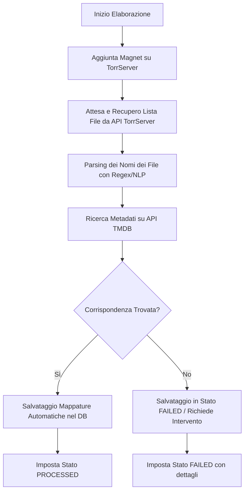

# Stremio Custom Catalog Provider

Questo repository contiene un sistema in Python per la creazione di un **catalogo Stremio personalizzato** a partire da file torrent o link magnetici (Magnet URI).

Il sistema analizza il contenuto dei torrent sfruttando l'API di **TorrServer** (che mappa i torrent in HTTP e fornisce la lista dei file), mappa i singoli file all'interno (episodi, stagioni o film) associandoli ai metadati ufficiali tramite **TMDB**, e li espone tramite le API di Stremio per consentirne lo streaming diretto. Include inoltre un'interfaccia web per monitorare lo stato, aggiungere nuovi contenuti e correggere manualmente eventuali errori di mappatura.

---

## 📌 Indice
- [Architettura del Sistema](#-architettura-del-sistema)
- [Gestione Coda su Database (MariaDB)](#-gestione-coda-su-database-mariadb)
- [Integrazione TorrServer](#-integrazione-torrserver)
- [Modello dei Dati (Database & Entità)](#-modello-dei-dati-database--entità)
- [Flusso di Elaborazione (Analisi Torrent)](#-flusso-di-elaborazione-analisi-torrent)
- [Integrazione Stremio](#-integrazione-stremio)
- [Sicurezza (Basic Auth)](#-sicurezza-basic-auth)
- [Servizi Docker (Docker Compose)](#-servizi-docker-docker-compose)
- [Struttura Proposta del Progetto](#-struttura-proposta-del-progetto)

---

## 🏗 Architettura del Sistema

Il progetto si compone di tre moduli principali che lavorano sullo stesso database relazionale e si interfacciano con TorrServer:

1. **Web UI & API Engine**:
   - Sviluppato in Python con **FastAPI**.
   - Espone gli endpoint compatibili con il protocollo Addon di Stremio (`manifest.json`, cataloghi, metadati, stream).
   - Renderizza un'interfaccia grafica (tramite template **Jinja2** o file statici con CSS personalizzato) per la gestione e la rimappatura manuale.
   - Protetto da **Basic Authentication** (configurata tramite variabili d'ambiente).

2. **CLI (Command Line Interface)**:
   - Strumento a riga di comando per importare ed elaborare istantaneamente un torrent/magnet in modalità sincrona.

3. **Background Worker**:
   - Processo asincrono leggero che esegue il polling dei torrent aggiunti via Web UI e rimasti in coda (`QUEUED`), coordinando le chiamate a TorrServer e TMDB per l'analisi e la catalogazione.

---

## ⚡ Gestione Coda su Database (MariaDB)

Per mantenere l'infrastruttura snella ed evitare la complessità di Redis e Celery, la coda è implementata direttamente nel database relazionale MariaDB.

1. Quando l'utente aggiunge un magnet da Web UI, viene inserito un record nella tabella `Torrents` con `status = 'QUEUED'`.
2. Il **Background Worker** (un processo Python in esecuzione nel suo container) esegue periodicamente una query atomica:
   ```sql
   SELECT * FROM torrents WHERE status = 'QUEUED' ORDER BY added_at ASC LIMIT 1 FOR UPDATE SKIP LOCKED;
   ```
3. Il worker imposta lo stato a `PROCESSING`, effettua l'analisi (chiamando TorrServer per i file e TMDB per i metadati) e imposta lo stato finale a `PROCESSED` o `FAILED`.
4. La Web UI mostra in tempo reale l'avanzamento dei torrent in coda tramite polling AJAX o WebSocket.

---

## 🔌 Integrazione TorrServer

Per evitare di gestire a basso livello il protocollo BitTorrent e la risoluzione dei magnet link (che richiede di contattare i peer DHT per scaricare il file torrent), il sistema si appoggia a **TorrServer**.

- Il sistema dialoga con TorrServer tramite le sue **API REST** (configurando `TORRSERVER_BASE_URL` in `.env`).
- Quando viene aggiunto un magnet, il worker lo invia a TorrServer.
- TorrServer scarica i metadati del torrent ed espone la lista dei file contenuti.
- Il worker interroga TorrServer per ricevere la lista dei file video, le loro dimensioni e i relativi indici di file (`file_index`), che verranno salvati in `FileMapping`.
- Nei link di streaming restituiti a Stremio, faremo riferimento agli endpoint HTTP generati da TorrServer o direttamente al magnet link indicizzato per file.

---

## 🗄 Modello dei Dati (Database & Entità)

Il database utilizzerà **MariaDB**, gestito tramite **SQLAlchemy** (ORM) e **Alembic** per le migrazioni. Di seguito la struttura logica proposta delle entità:

### 1. `Torrent`
Rappresenta il file torrent o magnet caricato dall'utente.
- `info_hash` (PK, String): Hash univoco del torrent. Previene duplicati.
- `magnet_url` (Text): Il link magnetico o URL torrent originale.
- `title` (String): Nome originale del torrent (es. "Breaking Bad S01-S05 1080p BluRay").
- `status` (Enum: `QUEUED`, `PROCESSING`, `PROCESSED`, `FAILED`): Stato dell'elaborazione.
- `error_message` (Text, Nullable): Dettagli sull'eventuale errore di elaborazione.
- `added_at` (DateTime): Data di aggiunta.
- `processed_at` (DateTime, Nullable): Data di completamento dell'analisi.

### 2. `MediaItem` (Movie o TV Show)
Entità principale per l'indicizzazione dei metadati reali del film o della serie TV.
- `id` (PK, Integer)
- `imdb_id` (String, Unique, Index): ID di IMDb (es. `tt0949578`). Fondamentale per Stremio.
- `type` (Enum: `movie`, `series`): Tipo di contenuto.
- `title` (String): Nome pulito della serie o del film (es. "Breaking Bad").
- `year` (Integer): Anno di rilascio.
- `poster_url` (String, Nullable): Link alla locandina.
- `background_url` (String, Nullable): Link allo sfondo.
- `tmdb_id` (Integer, Nullable): ID TMDB per arricchimento metadati.

### 3. `Episode` (Solo per `type = 'series'`)
Rappresenta un singolo episodio di una serie TV.
- `id` (PK, Integer)
- `media_item_id` (FK su `MediaItem.id`)
- `season` (Integer): Numero della stagione.
- `episode` (Integer): Numero dell'episodio.
- `title` (String, Nullable): Nome dell'episodio (es. "Pilot").

### 4. `FileMapping`
Associa un file specifico all'interno di un torrent a un `MediaItem` (se film) o a un `Episode` (se serie TV). Permette la rimappatura manuale in caso di errori.
- `id` (PK, Integer)
- `torrent_hash` (FK su `Torrent.info_hash`)
- `file_index` (Integer): Indice del file fornito da TorrServer.
- `file_path` (String): Percorso relativo del file all'interno del torrent (es. `Breaking Bad S01/S01E01.mkv`).
- `file_size` (BigInteger): Dimensione in byte (esclude file `.txt`, `.nfo`, ecc.).
- `media_item_id` (FK su `MediaItem.id`, Nullable): Collegato se è un film.
- `episode_id` (FK su `Episode.id`, Nullable): Collegato se è un episodio di una serie.
- `manually_corrected` (Boolean, Default `False`): Flag per indicare se l'utente ha modificato manualmente questa associazione.

---

## ⚙️ Flusso di Elaborazione (Analisi Torrent)

Quando un torrent passa in stato `PROCESSING`, il worker esegue i seguenti passaggi:



1. **Aggiunta su TorrServer**: Il worker invia il magnet link a TorrServer tramite API POST.
2. **Recupero File List**: TorrServer risolve il magnet ed espone i file. Il worker effettua una GET per recuperare la lista dei file.
3. **Name Parsing**: Tramite librerie di parsing dei nomi dei file (es. `PTN` in Python), si estraggono: Titolo, Stagione, Episodio.
4. **Associazione con TMDB**: Ricerca del titolo su TMDB per recuperare gli ID ufficiali (incluso l'IMDb ID) e i metadati.
5. **Salvataggio Mappature**: Ogni file video viene mappato all'episodio o film corrispondente.

---

## 📺 Integrazione Stremio

Stremio comunica con gli addon tramite un'interfaccia HTTP standard basata su JSON. Il nostro servizio API implementa i seguenti endpoint:

1. **Addon Manifest (`/manifest.json`)**:
   - Descrive l'addon, il nome, le risorse supportate (`catalog`, `stream`) e i tipi di contenuto (`movie`, `series`).
2. **Catalog Endpoint (`/catalog/{type}/{id}.json`)**:
   - Mostra l'elenco dei film o delle serie TV disponibili nel nostro database.
3. **Meta Endpoint (`/meta/{type}/{id}.json`)**:
   - Restituisce i dettagli di un film o di una serie (compreso l'elenco delle stagioni e degli episodi disponibili nel DB).
4. **Stream Endpoint (`/stream/{type}/{id}.json`)**:
   - Quando l'utente seleziona un film o un episodio, Stremio richiede il link di streaming.
   - L'API cerca i `FileMapping` associati e restituisce l'endpoint HTTP di streaming fornito da TorrServer per quello specifico `file_index`, consentendo la riproduzione diretta e fluida su qualsiasi dispositivo.

---

## 🔒 Sicurezza (Basic Auth)

La Web UI per la gestione dei torrent e per la rimappatura manuale degli episodi sarà protetta tramite **HTTP Basic Authentication**:
- Le credenziali saranno definite nelle variabili d'ambiente:
  - `BASIC_AUTH_USERNAME`
  - `BASIC_AUTH_PASSWORD`
- Qualsiasi richiesta non autenticata alle rotte della Web UI o delle API di gestione riceverà un errore `401 Unauthorized`.
- Gli endpoint dedicati a Stremio (`/manifest.json`, `/catalog`, `/stream`, etc.) rimarranno pubblici affinché Stremio possa interrogarli liberamente.

---

## 🐳 Servizi Docker (Docker Compose)

L'intera applicazione viene eseguita in isolamento tramite Docker. Il file `docker-compose.yml` conterrà tre servizi principali:

```yaml
version: '3.8'

services:
  db:
    image: mariadb:10.11
    container_name: stremio_catalog_db
    restart: always
    environment:
      MYSQL_DATABASE: stremio_catalog
      MYSQL_USER: catalog_user
      MYSQL_PASSWORD: catalog_password
      MYSQL_ROOT_PASSWORD: root_secure_password
    volumes:
      - db_data:/var/lib/mysql
    ports:
      - "3306:3306"

  web-api:
    build:
      context: .
      dockerfile: Dockerfile
    container_name: stremio_catalog_api
    restart: always
    command: uvicorn app.main:app --host 0.0.0.0 --port 8000 --reload
    environment:
      - DATABASE_URL=mysql+pymysql://catalog_user:catalog_password@db/stremio_catalog
      - TMDB_API_KEY=your_api_key_here
      - TORRSERVER_BASE_URL=http://your-torrserver-ip:8090
      - BASIC_AUTH_USERNAME=admin
      - BASIC_AUTH_PASSWORD=secure_password_here
    ports:
      - "8000:8000"
    depends_on:
      - db

  worker:
    build:
      context: .
      dockerfile: Dockerfile
    container_name: stremio_catalog_worker
    restart: always
    command: python app/worker.py
    environment:
      - DATABASE_URL=mysql+pymysql://catalog_user:catalog_password@db/stremio_catalog
      - TMDB_API_KEY=your_api_key_here
      - TORRSERVER_BASE_URL=http://your-torrserver-ip:8090
    depends_on:
      - db

volumes:
  db_data:
```

---

## 📂 Struttura Proposta del Progetto

```text
stremio-catalog-provider/
│
├── alembic/                  # Cartella per le migrazioni SQLAlchemy
├── app/
│   ├── __init__.py
│   ├── main.py               # Entrypoint FastAPI (API & Stremio Addon)
│   ├── worker.py             # Coda di background (Database processing worker)
│   │
│   ├── core/
│   │   ├── config.py         # Configurazione variabili d'ambiente (Basic Auth, TMDB, DB)
│   │   ├── database.py       # Connessione al DB SQLAlchemy
│   │   └── security.py       # Gestione del Basic Auth per la Web UI
│   │
│   ├── models/               # Modelli del database SQLAlchemy
│   │   ├── torrent.py
│   │   ├── media.py
│   │   └── mapping.py
│   │
│   ├── parser/               # Logica di parsing torrent e metadati
│   │   ├── torrent_parser.py # Analizza nomi file e trova SxxExx
│   │   ├── tmdb_client.py    # Interfaccia con le API di TMDB
│   │   └── torrserver.py     # Client API per comunicare con TorrServer
│   │
│   ├── routes/               # Endpoint FastAPI
│   │   ├── stremio.py        # Endpoint addon di Stremio (pubblici)
│   │   ├── web_ui.py         # Rotte per la Web UI (protette da Basic Auth)
│   │   └── api.py            # API per aggiungere torrent, forzare analisi, ecc. (protette)
│   │
│   ├── templates/            # Template HTML Jinja2 per la Web UI
│   │   ├── base.html         # Template base con navbar e design comune
│   │   ├── dashboard.html    # Stato dei torrent e pulsante di aggiunta
│   │   └── remap.html        # Interfaccia per la rimappatura manuale
│   │
│   └── static/               # Risorse CSS e JS per la Web UI
│       └── css/
│           └── style.css
│
├── cli/                      # Script CLI per l'importazione diretta
│   └── import_torrent.py
│
├── Dockerfile
├── docker-compose.yml
├── requirements.txt
└── README.md
```
