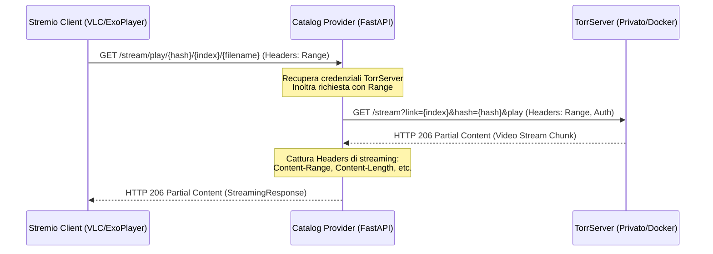

# Specifica Tecnica: Configurazione Base URL per Reverse Proxy e Gateway Streaming Proxy

* **Data**: 2026-07-28
* **Stato**: In Revisione
* **Autore**: Antigravity & Michele

---

## 1. Obiettivo & Contesto

Attualmente, il provider di catalogo Stremio genera i link di installazione e i link di streaming video basandosi sull'URL locale (`request.base_url`) o puntando direttamente all'URL di TorrServer. 

Quando il sistema viene distribuito dietro un **reverse proxy** (ad esempio, esposto su Internet tramite HTTPS):
1. I link della Dashboard e dell'Addon generati via `request.base_url` potrebbero non corrispondere all'URL pubblico se gli header di proxy (es. `X-Forwarded-Proto`, `X-Forwarded-Host`) non sono pienamente integrati o fidati.
2. Stremio (eseguito su TV o dispositivi esterni) non è in grado di accedere a TorrServer se questo è ospitato su una porta privata o su un indirizzo locale (`localhost:8090`).

### Obiettivo principale:
Introdurre la variabile d'ambiente `BASE_URL` per definire l'indirizzo pubblico del provider e implementare un **Gateway Streaming Proxy** in FastAPI che riceva le richieste dei video da Stremio, le inoltri internamente a TorrServer gestendo i Range Header (fondamentali per il seeking video) e restituisca il flusso multimediale in modo sicuro e trasparente, tenendo TorrServer completamente protetto all'interno della rete privata.

---

## 2. Architettura & Flusso dei Dati

### Flusso di Richiesta Video (Gateway Streaming Proxy):


---

## 3. Modifiche ai File di Progetto

### 3.1 Classe di Configurazione Applicazione
Creazione del file [app_config.py](file:///Users/michele/PycharmProjects/stremio-catalog-provider/stremio_catalog_provider/config/app_config.py) per astrarre le impostazioni generali dell'app.

```python
from typing import Optional

class AppConfig:
    """Configurazione generale del fornitore di catalogo."""

    def __init__(self, base_url: Optional[str] = None) -> None:
        # Se base_url è impostato, ci assicuriamo che finisca con una barra '/'
        if base_url and not base_url.endswith("/"):
            base_url += "/"
        self.base_url = base_url
```

### 3.2 Aggiornamento di `DefaultContainer`
File: [default_container.py](file:///Users/michele/PycharmProjects/stremio-catalog-provider/stremio_catalog_provider/container/default_container.py)
* Lettura della variabile `BASE_URL` dall'ambiente.
* Binding della classe `AppConfig` nel container Dependency Injection.

```python
# Aggiungere l'import:
from stremio_catalog_provider.config.app_config import AppConfig

# Nel metodo _init_bindings:
base_url = os.environ.get("BASE_URL")
self.injector.binder.bind(AppConfig, to=AppConfig(base_url))
```

### 3.3 Aggiornamento di `.env.example`
File: [.env.example](file:///Users/michele/PycharmProjects/stremio-catalog-provider/.env.example)
Aggiunta della documentazione per la configurazione.

```ini
# URL pubblico di questo provider per la dashboard e lo streaming (opzionale)
# Esempio: BASE_URL=https://stremio-catalog.mia-vps.com
BASE_URL=
```

### 3.4 Aggiornamento delle Rotte in `StremioController`
File: [stremio_controller.py](file:///Users/michele/PycharmProjects/stremio-catalog-provider/stremio_catalog_provider/controller/stremio_controller.py)
* Aggiunta del supporto all'oggetto `Request` negli endpoint esistenti.
* Aggiunta delle due rotte dedicate al proxy dello stream video.

```python
from fastapi import Request
from fastapi.responses import StreamingResponse

# Modifica registrazione rotte:
self.router.add_api_route(
    "/stream/{media_type}/{stream_id}.json", self.stream, methods=["GET"]
)
self.router.add_api_route(
    "/stream/play/{torrent_hash}/{file_index}", self.play_stream, methods=["GET"]
)
self.router.add_api_route(
    "/stream/play/{torrent_hash}/{file_index}/{filename}", self.play_stream, methods=["GET"]
)

# Modifica endpoint stream:
async def stream(self, media_type: str, stream_id: str, request: Request) -> dict[str, Any]:
    """Restituisce i flussi disponibili con URL che puntano al proxy."""
    return self.stremio_service.get_stream(media_type, stream_id, request)

# Nuova rotta proxy:
async def play_stream(
    self, torrent_hash: str, file_index: int, request: Request, filename: str = ""
) -> StreamingResponse:
    """Esegue il proxy del flusso video da TorrServer."""
    range_header = request.headers.get("range")
    generator, status_code, headers = await self.stremio_service.get_stream_proxy(
        torrent_hash, file_index, range_header
    )
    return StreamingResponse(generator, status_code=status_code, headers=headers)
```

### 3.5 Modifiche alla Logica di `StremioService`
File: [stremio_service.py](file:///Users/michele/PycharmProjects/stremio-catalog-provider/stremio_catalog_provider/service/stremio_service.py)
* Iniezione di `AppConfig`.
* Calcolo del base URL dinamico in base alla configurazione o all'oggetto `Request`.
* Generazione di URL per lo streaming puntando al proxy interno `/stream/play/...`.
* Implementazione del metodo `get_stream_proxy` asincrono con `httpx.AsyncClient` e inoltro trasparente dei range headers.

```python
import httpx
import urllib.parse
from typing import AsyncGenerator, Tuple, Dict, Optional
from stremio_catalog_provider.config.app_config import AppConfig

# Aggiornamento costruttore:
@inject
def __init__(
    self,
    media_repo: MediaItemRepository,
    mapping_repo: FileMappingRepository,
    torr_config: TorrServerConfig,
    app_config: AppConfig
) -> None:
    self.media_repo = media_repo
    self.mapping_repo = mapping_repo
    self.torr_config = torr_config
    self.app_config = app_config

# Aggiornamento get_stream:
def get_stream(self, media_type: str, stream_id: str, request: Optional[Request] = None) -> dict[str, Any]:
    # ... determinazione base url
    provider_base_url = self.app_config.base_url
    if not provider_base_url and request:
        provider_base_url = str(request.base_url)
    if not provider_base_url:
        provider_base_url = "http://localhost:8000/"

    # ... all'interno dei cicli di mappatura:
    filename = m.file_path.split("/")[-1]
    encoded_filename = urllib.parse.quote(filename)
    stream_url = f"{provider_base_url}stream/play/{m.torrent_hash}/{m.file_index}/{encoded_filename}"

# Nuovo metodo get_stream_proxy:
async def get_stream_proxy(
    self, torrent_hash: str, file_index: int, range_header: Optional[str]
) -> Tuple[AsyncGenerator[bytes, None], int, Dict[str, str]]:
    """Crea una connessione asincrona a TorrServer e produce chunk di dati."""
    headers = {}
    if range_header:
        headers["Range"] = range_header

    auth = None
    if self.torr_config.username and self.torr_config.password:
        auth = (self.torr_config.username, self.torr_config.password)

    url = f"{self.torr_config.base_url}/stream"
    params = {"link": str(file_index), "hash": torrent_hash, "play": ""}

    client = httpx.AsyncClient()
    try:
        req = client.build_request("GET", url, params=params, headers=headers, auth=auth)
        response = await client.send(req, stream=True, timeout=None)
        
        # Filtriamo e propaghiamo solo gli header rilevanti
        propagate_headers = {}
        for h in ["content-range", "content-length", "content-type", "accept-ranges"]:
            if h in response.headers:
                propagate_headers[h] = response.headers[h]

        async def chunk_generator() -> AsyncGenerator[bytes, None]:
            try:
                # 128KB chunk size
                async for chunk in response.aiter_bytes(chunk_size=128 * 1024):
                    yield chunk
            finally:
                # Chiusura pulita delle risorse in caso di completamento o interruzione del player
                await response.aclose()
                await client.aclose()

        return chunk_generator(), response.status_code, propagate_headers

    except Exception as e:
        await client.aclose()
        raise e
```

### 3.6 Aggiornamento della Dashboard in `WebUiController`
File: [web_ui_controller.py](file:///Users/michele/PycharmProjects/stremio-catalog-provider/stremio_catalog_provider/controller/web_ui_controller.py)
* Iniezione di `AppConfig`.
* Aggiornamento del calcolo di `stremio_url` per usare la configurazione `AppConfig` come priorità rispetto a `request.base_url`.

```python
# Aggiungere import AppConfig
# Modificare costruttore includendo app_config
# Modificare dashboard per il calcolo di stremio_url:
base_url = self.app_config.base_url or str(request.base_url)
if not base_url.endswith("/"):
    base_url += "/"
stremio_url = f"{base_url}manifest.json"
```

---

## 4. Gestione Errori e Casi Limite

1. **Client Disconnesso (Abbandono della riproduzione)**: 
   Nel momento in cui l'utente spegne o interrompe la riproduzione, FastAPI solleva un'eccezione interna di disconnessione client. Il blocco `finally` all'interno del generatore di chunk asincrono assicura che sia la risposta di TorrServer sia il client HTTP vengano immediatamente chiusi, prevenendo perdite di socket o file descriptor aperti.
2. **TorrServer non raggiungibile**:
   Se TorrServer restituisce un errore 503 o non risponde, l'eccezione viene sollevata e FastAPI risponderà con un errore 502/500 standard.
3. **Mancanza di Range Header**:
   Se il client riproduce il video dall'inizio senza inviare un range (es. prima richiesta di metadati video), il proxy effettua una richiesta completa a TorrServer e risponde con `200 OK` (anziché `206`), propagando correttamente i dettagli di dimensione del file.

---

## 5. Strategia di Test

Aggiungeremo test unitari e di integrazione dedicati in `tests/service/test_stremio_service.py` e `tests/controller/test_stremio_controller.py` per:
1. Verificare che se `BASE_URL` è configurato nell'ambiente, i link generati dall'addon lo utilizzino correttamente.
2. Verificare che se `BASE_URL` è vuoto, i link facciano fallback su `request.base_url`.
3. Testare la rotta di streaming mockando le chiamate a TorrServer con `respx` o patchando `httpx.AsyncClient` per simulare l'invio e la corretta propagazione di Range Headers e status code (206 Partial Content).
